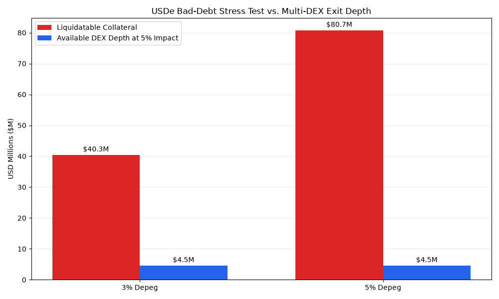

# Aave V3 Ethena (USDe / sUSDe) Risk Engine & Solvency Monitor

[](https://aave.com/)
[](https://ethena.fi/)
[](https://python.org)
[](LICENSE)

An on-chain risk toolkit built to stress-test and monitor Ethena's synthetic dollar (`USDe` and `sUSDe`) on Aave V3.

Instead of relying on delayed dashboards, this engine queries Ethereum RPC nodes and live market data directly to analyze **loan book health**, **whale concentration**, **intraday price shocks**, **real-time multi-DEX exit liquidity**, and **systemic bad-debt risk under depeg scenarios**.

---

## ⚡ Quick Takeaways (TL;DR)

1. **Looping Hit the Ceiling:** Yield loopers filled Aave V3 Plasma deposits to 100% capacity, forcing risk stewards to rapidly expand supply caps ($550M → $750M).
2. **Whale Concentration is Extreme:** Just 2 protocol custody contracts hold **81.9%** of the entire $4.87B USDe supply (Gini coefficient: **0.9998**).
3. **Thin DEX Liquidity:** While tradable float is ~$430M, total secondary DEX exit liquidity (Uniswap + Curve) is only **~$86M**. A massive liquidation cannot exit via AMMs without severe slippage.
4. **Oracle Filtered the Flash Crash:** When Binance spot briefly wicked down to **$0.9202** on Sep 22, 2026, Aave's Chainlink aggregator held above **$0.9970**, saving healthy borrowers from unfair liquidations.
5. **The Bad-Debt Liquidity Cliff:** In a 3%–5% USDe depeg shock, $40.3M–$80.7M of looped collateral becomes liquidatable. However, aggregated secondary DEX exit depth can only absorb **~$4.5M–$4.7M** before exceeding 5% price impact, exposing Aave to an uncovered bad-debt gap of up to **$76.2M**.

---

## 📊 Visual Risk Breakdown

### 1. TVL Inflow vs. Supply Caps
How fast deposits grew compared to risk steward limit adjustments:


* **Aug 10:** Supply cap reduced ($475M → $375M) to remove idle buffer.
* **Sep 22:** High yield looping drove deposits straight into the $550M ceiling.
* **Action:** Risk stewards expanded the cap to $750M to keep borrow transactions from failing.

---

### 2. Supply Breakdown & Whale Inequality
Where is all the USDe actually located?


```text
Total USDe Supply: $4.87 Billion (100%)
├── 🏛️ Protocol Locked:        $3.99B (81.9%)  [Bridge Escrow, Staking Vault, Aave Pool]
├── 🏦 CEX Hedge Margin:       $0.45B  (9.2%)  [Derivatives backing on Bybit / Binance]
└── 💧 Active Tradable Float:  $0.43B  (8.8%)  [Circulating tokens / Looper capital]

⚠️ Secondary AMM Liquidity:    $0.086B ($86M total across Curve & Uniswap)
```

* **Gini Score (0.9998):** Top 0.3% of addresses hold over 99.7% of all tokens.
* **AMM Liquidity Cliff:** Liquidating even a single whale borrower would drain secondary on-chain pools.

---

### 3. Hourly Price Shocks & Max Drawdown
Daily charts hide intra-day flash crashes. Here is the hourly breakdown over 61 days:


* **Binance Spot Dip ($0.9202):** A localized order book imbalance triggered an 8% drop.
* **Chainlink Oracle Buffer:** The multi-source feed smoothed out the glitch (> $0.9970), preventing safe accounts ($H_f \approx 1.23$) from cascading liquidations.

---

### 4. USDe Bad-Debt Stress Test vs. Multi-DEX Exit Depth
What happens to protocol solvency when a depeg shock triggers recursive liquidations?



| Depeg Scenario | Liquidatable Collateral | Available DEX Depth (@ 5% Impact) | Bad-Debt Shortfall Gap | Protocol Status |
| :--- | :--- | :--- | :--- | :--- |
| **3% Depeg Shock** | **$40.3M** | **$4.5M** | **$35.8M** | Liquidators bottlenecked; slippage exceeds liquidation bonus |
| **5% Depeg Shock** | **$80.7M** | **$4.5M** | **$76.2M** | AMM liquidity exhausted; massive socialized protocol bad debt |

* **Looped Tranche Vulnerability:** Approximately 15% of Aave V3's USDe deposits consist of high-leverage recursive loopers (supplying USDe to borrow stablecoins and loop back).
* **The Liquidity Mismatch:** While paper collateral stands in the hundreds of millions, live multi-DEX routing across all Ethereum AMMs (Uniswap V3/V4, Curve, Fluid, Balancer) can only absorb **~$4.5M** of USDe before reaching a 5% price impact ceiling.
* **Insolvency Cascade:** When collateral value falls and liquidators cannot swap seized USDe without 10%–50%+ slippage, liquidation bots halt execution. Unliquidated loans sink below 1.0 health factor, generating uncollateralized bad debt directly absorbed by Aave suppliers.

---

### 5. Live Multi-DEX Liquidity Depth Profiling (USDe → USDC)
Measuring executable market depth at specific price impact tiers using real-time smart order routing:

| Target Price Impact | Max Executable USDe Sell Volume | Realized Price Impact | Routing Distribution |
| :--- | :--- | :--- | :--- |
| **1.0% Impact** | **~$4.32M USDe** | ~0.89% | Uniswap v4, Uniswap v3, Curve Stable NG, Fluid DEX |
| **3.0% Impact** | **~$4.57M USDe** | ~2.84% | Curve Stable NG, Uniswap v4, LitePSM, DAI/USDS |
| **5.0% Impact** | **~$4.70M USDe** | ~4.91% | Curve Stable NG, Uniswap v4, Fluid DEX, LitePSM |

* **Steep Liquidity Drop-off:** Liquidity depth is highly non-linear. The market can absorb up to ~$4.3M with reasonable slippage, but attempting to execute just $400K more pushes slippage straight to 5%, beyond which liquidity drops off a cliff.

---

## 🔎 Verified Parameters & Contract Addresses

| Layer | Parameter / Target | Verified Value | Context |
| :--- | :--- | :--- | :--- |
| **Governance** | Plasma USDe Supply Cap (Aug 10) | $475M → $375M | Cut due to 57.3% low utilization |
| **Governance** | Plasma sUSDe Supply Cap (Aug 10) | $450M → $225M | Cut due to 34.8% low utilization |
| **Governance** | Plasma USDe Supply Cap (Sep 22) | $550M → $750M | Emergency boost (100% capacity hit) |
| **Governance** | Core USDe Borrow Cap (Sep 22) | $700M → $100M | Slashed (borrowers use Plasma, not Core) |
| **On-Chain Contract** | Aave V3 Pool Proxy | `0x87870Bca3F3fD6335C3F4ce8392D69350B4fA4E2` | Ethereum Mainnet |
| **On-Chain Contract** | Ethena USDe Token | `0x4c9edd5852cd905f086c759e8383e09bff1e68b3` | ERC-20 contract |
| **Price / Oracle** | Binance Spot Low (Sep 22) | $0.9202 | 1-min order book tick |
| **Price / Oracle** | Chainlink Aggregator Peg (Sep 22) | > $0.9970 | Filtered out CEX order book noise |
| **DEX Liquidity** | Aggregated Depth @ 1% Impact | ~$4.32M USDe | Live smart order routing (USDe → USDC) |
| **DEX Liquidity** | Aggregated Depth @ 5% Impact | ~$4.70M USDe | Maximum viable exit capacity before slippage cliff |
| **Solvency Stress** | 3% Depeg Bad-Debt Gap | $35.8M | Liquidatable ($40.3M) vs. DEX Depth ($4.5M) |
| **Solvency Stress** | 5% Depeg Bad-Debt Gap | $76.2M | Liquidatable ($80.7M) vs. DEX Depth ($4.5M) |

---

## 🚀 Quickstart

### 1. Clone & Install
```bash
git clone https://github.com/Radioactivegeek/aave-v3-USDe-risk.git
cd aave-v3-USDe-risk

python -m venv venv
# Linux/macOS:
source venv/bin/activate
# Windows PowerShell:
.\venv\Scripts\Activate.ps1

pip install -r requirements.txt
```

### 2. Run the Scripts

* **Simulate Bad-Debt & Solvency Under Depeg Stress:**
  ```bash
  python scripts/usde_bad_debt_stress_test.py
  ```
  *Fetches live Aave V3 USDe TVL from DefiLlama, evaluates real-time aggregated DEX exit capacity via KyberSwap, models 3% and 5% depeg scenarios, and outputs the uncovered bad-debt gap while generating `assets/usde_bad_debt_test.png`.*

* **Solve Real-Time Multi-DEX Liquidity Depth:**
  ```bash
  python scripts/usde_liquidity_depth.py
  ```
  *Binary-searches live smart order routes to calculate the exact maximum USDe sell capacity at 1%, 3%, and 5% price impact thresholds.*

* **Scan Active Borrower Health Factors (Live RPC):**
  ```bash
  # Scan recent USDT borrowers on Aave V3 (last 120 mins)
  python scripts/scan_health_factors.py --token USDT --minutes 120

  # Scan USDC borrowers over 2,500 blocks
  python scripts/scan_health_factors.py --token USDC --blocks 2500
  ```

* **Analyze Whale Concentration & Gini / HHI:**
  ```bash
  python scripts/usde_chart.py
  ```

* **Plot Hourly Drawdown & Price Volatility:**
  ```bash
  python scripts/usde_volatility_analysis.py
  ```

* **Compare Inflows vs. Governance Caps:**
  ```bash
  python scripts/plot_aave_usde.py
  ```

---

## 📁 Repository Layout

```text
├── assets/                          # Generated charts, stress test visuals & risk reports
│   ├── aave_plasma_usde_caps.png
│   ├── usde_advanced_concentration_lorenz.png
│   ├── usde_bad_debt_test.png       # Bad-debt vs. DEX depth stress test visual
│   ├── usde_holder_concentration.png
│   └── usde_hourly_volatility_drawdown.png
├── data/                            # On-chain snapshots & governance proposal logs
│   ├── llama_risk_proposals.json
│   └── usde_holders_distribution.csv
├── scripts/                         # Production analysis & live RPC scanner scripts
│   ├── plot_aave_usde.py            # TVL inflow vs. risk steward caps
│   ├── scan_health_factors.py       # Live RPC borrower health factor scanner
│   ├── usde_bad_debt_stress_test.py # Live bad-debt solvency stress simulation
│   ├── usde_chart.py                # Holder concentration & Gini/HHI curve
│   ├── usde_liquidity_depth.py      # Real-time multi-DEX depth solver
│   └── usde_volatility_analysis.py  # Hourly volatility & drawdown analyzer
├── requirements.txt                 # Python dependencies (web3, requests, matplotlib, etc.)
└── README.md                        # Risk memo & usage guide
```

---

### Author & Methodology Notes

Designed as a quantitative risk case study and production toolset for protocol risk analysis, monitoring parameter updates, evaluating collateral onboarding, and simulating extreme market liquidity stress on Aave V3.
