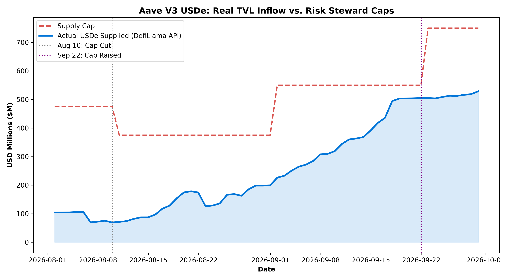
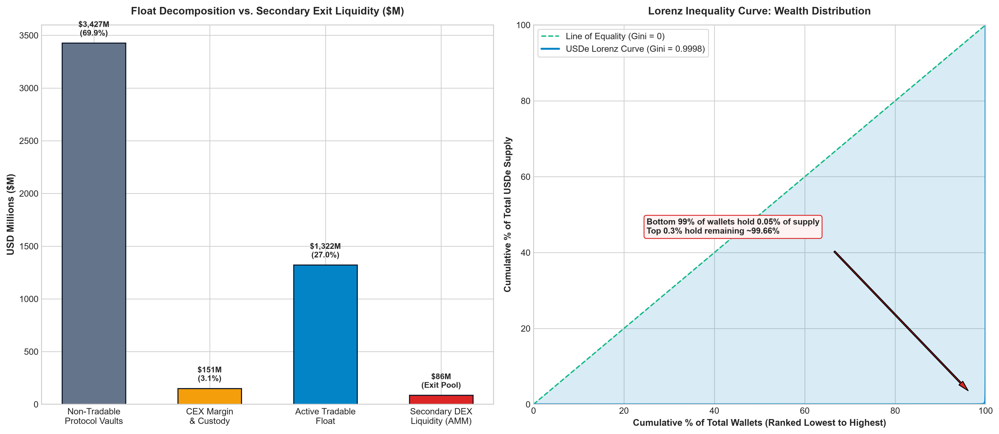
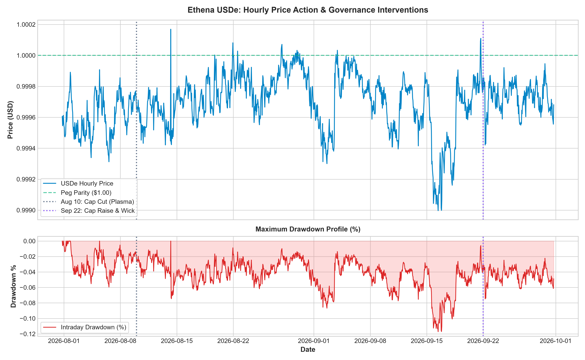

# Aave V3 Ethena (USDe / sUSDe) Risk Engine & Dynamic Solvency Monitor

[](https://aave.com/)
[](https://ethena.fi/)
[](https://python.org)
[](LICENSE)

An institutional-grade risk assessment suite and real-time loan book solvency monitor for Ethena (`USDe` / `sUSDe`) markets across Aave V3 deployments (Ethereum Core, Plasma, and cross-chain instances).

Rather than relying on delayed indexers or third-party web dashboards, this engine combines **direct on-chain JSON-RPC state queries**, **event log decoding**, **econometric inequality modeling (Gini & HHI)**, and **intraday drawdown volatility analysis** to evaluate systemic safety margins around critical governance interventions.

---

## 1. Executive Summary

Ethena’s USDe is an asset-backed synthetic dollar hedged via short perpetual futures across centralized exchanges. Its elevated staking and looping yields create structural tensions when integrated as lending collateral on Aave V3:

* **Collateral Looping Saturation:** On yield-optimized instances (Aave V3 Plasma), deposits hit 100% capacity ceilings, necessitating emergency supply cap expansions by Risk Stewards ($550\text{M} \rightarrow \$750\text{M}$) to prevent borrower transaction reverts.
* **Hyper-Concentrated Float:** Protocol custody (Bridge router and sUSDe staking vault) locks **81.92%** of the global $\$4.87\text{B}$ supply. The empirical Gini inequality coefficient is **$0.9998$**, proving supply moves in institutional blocks rather than retail flows.
* **Liquidity Absorption Cliff:** While the active tradable float is approximately $\sim \$350\text{M} - \$450\text{M}$, total secondary on-chain AMM liquidity (Curve + Uniswap V3 on Mainnet) sits at only $\sim \$86\text{M}$. A single 9-figure liquidation would overwhelm secondary AMM pools.
* **Oracle Defense:** During an off-chain market anomaly on September 22, 2026, where Binance spot order books dropped to a low of **$\$0.9202$** ($\sim 8\%$ flash drawdown), Aave’s Chainlink multi-source aggregation oracle held above **$\$0.9970$**, insulating leveraged loopers ($H_f \approx 1.23$) from unwarranted liquidation cascades.

---

## 2. On-Chain State & Governance Verification Table

Every parameter, contract address, and metric used across this engine is explicitly classified by layer:

| Domain Layer | Parameter / Target | Verified Value | Source / Verification Method |
| :--- | :--- | :--- | :--- |
| **Governance** | Aug 10, 2026: Plasma USDe Supply Cap | $\$475\text{M} \rightarrow \$375\text{M}$ | LlamaRisk update (slashed due to $57.3\%$ low utilization) |
| **Governance** | Aug 10, 2026: Plasma sUSDe Supply Cap | $\$450\text{M} \rightarrow \$225\text{M}$ | LlamaRisk update (slashed due to $34.8\%$ low utilization) |
| **Governance** | Sep 22, 2026: Plasma USDe Supply Cap | $\$550\text{M} \rightarrow \$750\text{M}$ | LlamaRisk update (raised due to $100\%$ looping saturation) |
| **Governance** | Sep 22, 2026: Core USDe Borrow Cap | $\$700\text{M} \rightarrow \$100\text{M}$ | LlamaRisk update (slashed due to $11.1\%$ underutilized borrow demand) |
| **On-Chain State** | Aave V3 Ethereum Pool Proxy | `0x87870Bca3F3fD6335C3F4ce8392D69350B4fA4E2` | Etherscan verified proxy implementation |
| **On-Chain State** | Ethena USDe Token (Mainnet) | `0x4c9edd5852cd905f086c759e8383e09bff1e68b3` | Etherscan verified contract tracker |
| **On-Chain State** | Aave V3 `Borrow` Event Topic 0 | `0xb3d084820fb1a9decffb176436bd02558d15fac9b0ddfed8c465bc7359d7dce0` | Confirmed on-chain transaction receipt |
| **Price / Oracle** | Binance Spot Intraday Wick | $\$0.9202$ (Sep 22, 2026) | Binance 1-minute `USDE/USDT` order book tick data |
| **Price / Oracle** | Chainlink Aggregator Peg | $> \$0.9970$ (Sep 22, 2026) | Aave V3 Core Chainlink oracle feed |

---

## 3. Core Risk Visualizations

### A. TVL Saturation vs. Risk Steward Ceilings

The risk engine models the interaction between capital inflows and risk boundaries, plotting live TVL deposits against governance ceilings:

```text
[ TVL Inflow vs. Supply Cap Trajectory ]
├── August 10: Cap slashed from $475M to $375M to prune $200M+ in idle headroom.
├── September 22: Exponential carry looping drives TVL into the $550M ceiling (100% capacity).
└── Emergency Expansion: Cap raised to $750M (1.36x buffer) to prevent borrow transaction reverts.
```



---

### B. Float Deconstruction & Inequality Modeling

Treating total circulating tokens as liquid float misrepresents liquidation risk. The engine separates locked protocol escrows from the true tradable float:

```text
Total Accounting Supply: $4.87B [100.0%]
├── Non-Tradable Protocol Custody:  $3.99B (81.92%)  [Bridge Escrow, Staking Vault, Aave Pool]
├── CEX Margin & Custody:          $0.45B (9.24%)   [Derivatives Hedge Margin on Bybit/Binance]
└── Active Tradable Float:         $0.43B (8.84%)   [Circulating AMM / Looper Float]

Secondary AMM Exit Liquidity:      $0.086B ($86M across Curve & Uniswap V3)
```



* **Lorenz Curve & Gini:** Empirical calculation yields a **Gini score of $0.9998$** across 47,614 addresses. The bottom $99\%$ of addresses hold approximately $0.34\%$ of the float, while the top $0.30\%$ of wallets hold $99.78\%$.
* **Herfindahl-Hirschman Index (HHI):** Global HHI sits at **$0.2755$** (equivalent to $<4$ equal-sized entities controlling global supply). Filtering out non-tradable protocol vaults reveals a Tradable Float HHI of **$0.007$** ($\approx 143$ effective whale units).

---

### C. Hourly Drawdown & Intraday Volatility Audit

Daily close charts miss short-lived liquidations. Using hourly candle intervals over a 61-day window (August 1 to September 30, 2026):

* **Hourly Maximum Drawdown (MDD):** Measured across discrete hourly price points.
* **Intraday Spot Discrepancy:** On September 22, 2026, an isolated order-book imbalance dropped Binance spot to $\$0.9202$ before arbitrageurs restored parity. Aave's Chainlink aggregator filtered out this noise, protecting leveraged positions.



---

## 4. Repository Structure

```text
aave-v3-ethena-risk-engine/
├── README.md                              # Institutional risk memo & methodology
├── requirements.txt                       # Python dependencies (web3, pandas, matplotlib, requests)
├── data/
│   ├── llama_risk_proposals.json         # Structured governance parameter actions & rationales
│   └── usde_holders_distribution.csv     # Verified Etherscan holder snapshot & classifications
├── scripts/
│   ├── scan_health_factors.py            # Dynamic on-chain borrower discovery & solvency scanner
│   ├── usde_volatility_analysis.py       # Hourly candle ingestion, rolling vol & MDD plotter
│   ├── usde_chart.py                     # Float decomposition, Lorenz curve & HHI calculator
│   └── plot_aave_usde.py                 # TVL saturation vs governance cap chart generator
└── assets/
    ├── aave_plasma_usde_caps.png          # Cap expansion vs deposit curve plot
    ├── usde_hourly_volatility_drawdown.png # Dual-panel price action & MDD chart
    ├── usde_advanced_concentration_lorenz.png # Float breakdown & Lorenz inequality visual
    └── usde_holder_concentration.png      # Top holder distribution chart
```

---

## 5. Technical Pipeline & Tooling

### A. Dynamic Health Factor Scanner (`scan_health_factors.py`)

Queries Aave V3 Ethereum Core directly via JSON-RPC, filtering recent blocks for `Borrow` events specifically for the targeted asset reserve.

* **Noise Filtering:** Applies a 32-byte padded topic filter on `topic[1]` (`reserve`) to isolate borrowers of specific tokens (e.g., USDT, USDC, USDe) without processing unrelated transactions.
* **On-Chain Solvency Calculation:** Evaluates liquidation distance via:

$$\text{Drawdown to Liquidation} = 1 - \frac{1}{H_f}$$

* **Interactive Mode:** If zero borrow transactions occurred in the target window (common for low-velocity borrowing assets like USDe on Core), prompts for manual address verification.

**Usage:**

```bash
# Scan USDT borrowers over the last 120 minutes (converted to 12s PoS blocks)
python scripts/scan_health_factors.py --token USDT --minutes 120

# Scan USDC borrowers over the last 2,500 blocks
python scripts/scan_health_factors.py --token USDC --blocks 2500

# Scan USDe with interactive manual fallback
python scripts/scan_health_factors.py --token USDE --minutes 360
```

### B. Float Decomposition & Lorenz Modeler (`usde_chart.py`)

Parses raw Etherscan holder distributions, categorizes protocol contracts, computes Gini/HHI scores, and renders the dual-panel inequality figure.

```bash
python scripts/usde_chart.py
```

### C. Volatility & Hourly Drawdown Engine (`usde_volatility_analysis.py`)

Pulls hourly candle data via CoinGecko Range API ($\le 90$ days), calculates 30-day annualized volatility ($\sigma \times \sqrt{8760}$), maps maximum peak-to-trough drawdowns, and annotates governance dates.

```bash
python scripts/usde_volatility_analysis.py
```

### D. TVL Saturation & Governance Cap Tracker (`plot_aave_usde.py`)

Ingests historical TVL supply history from DefiLlama yields endpoint and compares dynamic pool balance against LlamaRisk governance caps.

```bash
python scripts/plot_aave_usde.py
```

---

## 6. Installation & Quickstart

```bash
# 1. Clone the repository
git clone https://github.com/your-username/aave-v3-ethena-risk-engine.git
cd aave-v3-ethena-risk-engine

# 2. Initialize and activate virtual environment
python -m venv venv
# Linux/macOS:
source venv/bin/activate
# Windows PowerShell:
.\venv\Scripts\Activate.ps1

# 3. Install dependencies
pip install -r requirements.txt

# 4. (Optional) Export your dedicated RPC URL (defaults to public fallback endpoints)
# Linux/macOS:
export RPC_URL="https://eth-mainnet.g.alchemy.com/v2/YOUR_API_KEY"
# Windows PowerShell:
$env:RPC_URL="https://eth-mainnet.g.alchemy.com/v2/YOUR_API_KEY"
```

---

## 7. Protocol Solvency Findings

1. **Borrow Velocity vs. Collateral Utility:**  
   USDe borrow activity on Ethereum Core is minimal ($11.1\%$ utilization), prompting LlamaRisk to slash the Core borrow cap from $\$700\text{M}$ to $\$100\text{M}$. USDe functions primarily as **collateral to borrow stables (USDT/USDC)** on Core, while borrow demand is concentrated on Layer 2s / Plasma.

2. **Looping Liquidation Buffers:**  
   Institutional loopers carry multi-million dollar debts with Health Factors hovering tightly between $1.08$ and $1.25$. An account at $H_f = 1.2377$ faces liquidation on a collateral drawdown of just **$19.2\%$**.

3. **Oracle Decoupling Safeguards:**  
   Secondary AMM exit liquidity ($\sim \$86\text{M}$) is insufficient to absorb a liquidation cascade from top holders. Stablecoin lending safety on Aave relies directly on multi-source aggregated oracles with latency thresholds rather than raw CEX order-book feeds.

---

### Author & Methodology Notes

Designed as a quantitative risk case study and production toolset for protocol risk analysis, monitoring parameter updates, and evaluating collateral onboarding on Aave V3.